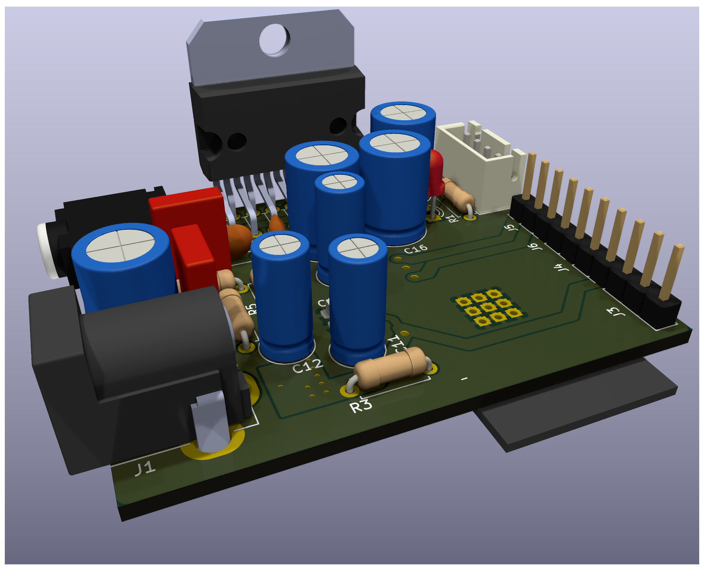
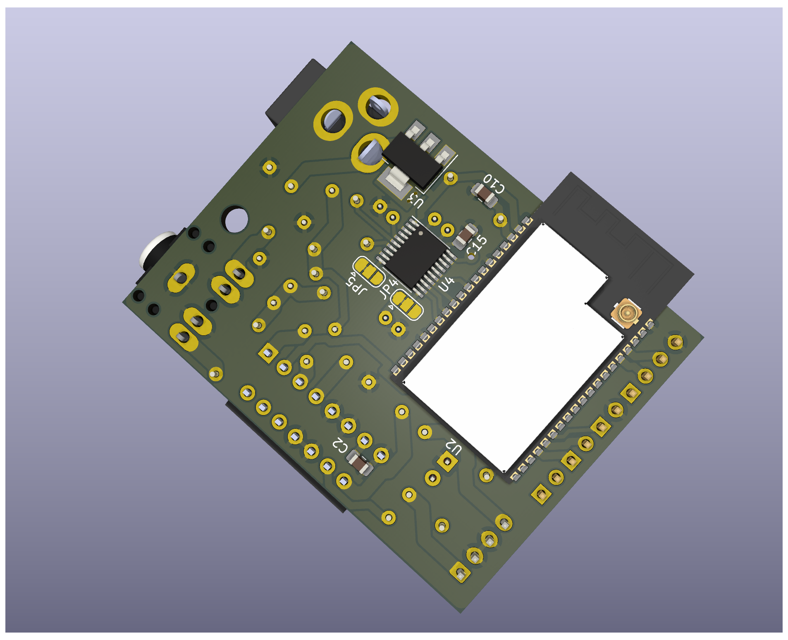
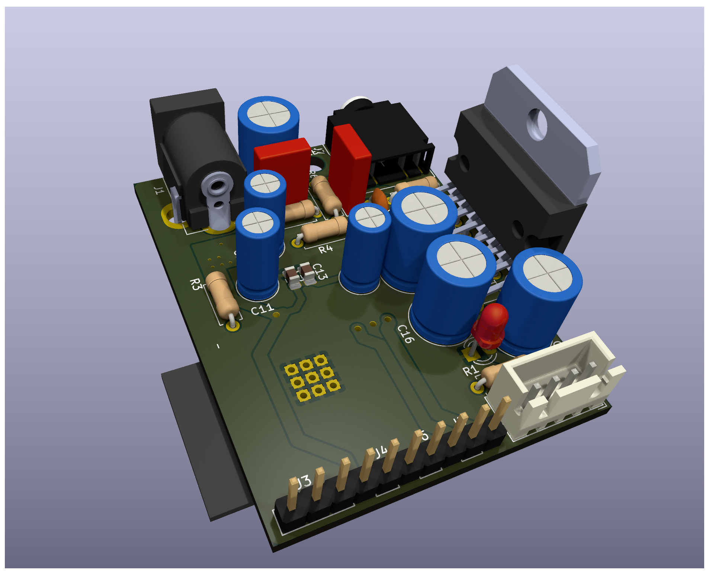

# Domosonica - WiFi Audio Streaming Board

## Project Overview

Domosonica is an experimental sound spatialization project that aims to create an accessible platform for the creation and immersive listening of spatialized audio, offering a multidirectional acoustic experience. Unlike traditional approaches that often involve expensive technologies and are confined to exclusive cultural settings, Domosonica takes an inclusive approach by leveraging recycled or low-cost technological resources.

This repository contains the design files for the WiFi-enabled audio streaming board, the core electronic component of the Domosonica project.

## Key Features

- **Inclusive Access**: Designed to break down barriers, making spatialized audio accessible to a wide range of creators, artists, students, and educators.
- **Community Interaction**: Fosters social connections and collaboration between diverse stakeholders in the arts and the local community.
- **Democratizing Sound Art**: By embracing low-cost and recycled technologies, Domosonica democratizes technological sound art, making it available to a broader audience.
- **Cultural Enrichment**: Contributes significantly to the cultural landscape of Parque de Los Patricios, aligning with the identity of the Technology District of Buenos Aires.

## Technical Specifications

### Hardware Components

1. **ESP32 Microcontroller**: A powerful microcontroller with Wi-Fi and Bluetooth capabilities, serving as the heart of the project. It handles internet connectivity, file storage, and audio output.

2. **TDA7496 Stereo Amplifier**: Each board includes a stereo amplifier capable of driving a pair of speakers directly.

3. **SPIFFS (Serial Peripheral Interface Flash File System)**: An onboard file system used by the ESP32 for storing files, useful for caching audio content.

4. **I2S Digital Audio Interface**: A communication protocol specifically designed for digital audio. The ESP32's I2S interface connects to the internal DAC for audio output.

5. **Recycled Speakers**: The system uses speakers salvaged from old televisions, mounted in custom 3D-printed enclosures.

### Circuitry

- **I2S Pins**: The ESP32 is connected to the DAC using specific pins dedicated to I2S communication. These pins transmit the clock signals and the audio data.
- **Power Supply**: The ESP32 and the audio output devices require a stable power supply. USB power or a regulated power adapter can be used.
- **Stereo Output**: Each board drives two speakers independently for stereo sound reproduction.

### Software Components

- **WiFi Library**: For connecting the ESP32 to the internet via Wi-Fi.
- **HTTPClient Library**: For handling HTTP requests to download audio files.
- **SPIFFS Library**: For interfacing with the ESP32's onboard file system.
- **AudioTools Library**: A comprehensive library for audio playback, including support for various audio formats and protocols, including MP3 decoding and I2S.
- **AudioLibs and AudioCodecs**: Additional libraries that provide specific functionality, such as interfacing with the SPIFFS and decoding audio files.

### Setup and Configuration

- Wi-Fi credentials and target URL for audio streams are specified in the firmware.
- I2S and audio playback settings are configured to match the capabilities of the ESP32 and the connected audio hardware.

### Usage

Once the system is powered and the firmware is running:
1. The ESP32 connects to the specified Wi-Fi network.
2. It receives audio streams from the network.
3. Audio playback occurs automatically using the I2S protocol through the TDA7496 amplifier.

## The Dome Installation

The geodesic dome measures 4 meters in diameter and is suspended from the ceiling of "Circo" at CheLA. The structure is held by 5 attachment points (carabiners), keeping the space below free for visitors to explore its interior from a sonic perspective.

### Speaker Design

30 custom enclosures were designed and 3D printed, each housing a recycled television speaker. These speakers were mounted at the nodes of the geodesic dome structure and connected in pairs to each streaming board.

### Board Manufacturing

The PCB was designed from scratch using KiCad (open-source software). The boards were manufactured in China and then hand-soldered at the Pedalúdico workshop at CheLA.

## Location

**CheLA (Centro Hipermediático Experimental Latinoamericano)** is a cultural center located in Buenos Aires, Argentina. It is known for its focus on experimental and multimedia arts, technology, and cultural activities. CheLA provides a space for artists, creators, and researchers to explore various forms of art and technology.

## Educational Workshops

The project included a series of workshops:

- **Amplifier Building Workshops**: A series of 3 workshops (15 participants each) where young people built amplifiers using recycled TV speakers. Participants took home their own amplifiers to connect to their phones and listen to music.

- **FADU (UBA) Collaborations**: Practical sessions were conducted with design students from the Faculty of Architecture, Design and Urbanism at the University of Buenos Aires.

- **Community Building**: Neighborhood residents from Barracas participated in the construction of the dome, which was assembled using PVC pipes shaped with a heat gun.

## Final Conclusions

### Technical Learnings

The ESP32 microcontroller, while powerful and cost-effective, proved to have limitations when processing large volumes of audio signals simultaneously. The board was designed with only **two stereo channels** per unit, which initially seemed limiting for an immersive audio installation.

### Scaling the Solution

To overcome the channel limitation, we manufactured **20 boards in total**, resulting in **40 independent audio channels** distributed throughout the dome. While achieving perfect synchronization across all WiFi-connected units presented challenges, we managed to obtain sufficient synchronization to create compelling surround sound effects.

### Artistic Results

The system enabled some truly **interesting surround sound experiments** inside the dome. The ability to independently control each speaker pair over the local network opened creative possibilities for spatial audio compositions and performances.

### Future Potential

The dome has significant untapped potential. Our vision is to develop a platform that would allow artists from around the world to simultaneously stream their instruments to each speaker independently, creating a new paradigm for collaborative spatial audio performances.

## Safety Notes

- Ensure the power supply is within the acceptable range for the ESP32 and other components to avoid damage.
- Be cautious with speaker volume to prevent hearing damage.
- Properly insulate all connections to prevent shorts.

## License

Domosonica is an open source project. Feel free to use, modify, and share it within the terms of the license.

## Contributing

We welcome contributions from artists, technologists, educators, and anyone interested in pushing the boundaries of sound art.
